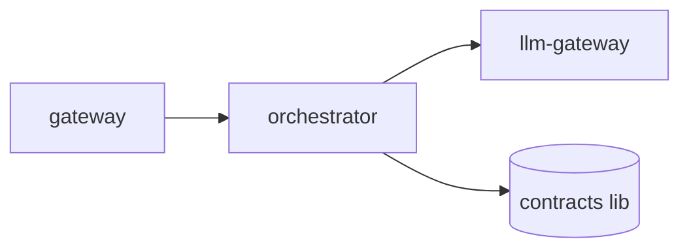
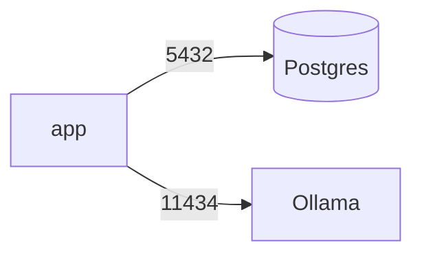

# README & spec templates

Fill from `docs/onboarding/project-map.md`. Delete headings that do not apply —
an empty section is worse than an absent one. Keep unverified build/run claims
tagged `> ⚠️ unverified` until `run-guide` proves them.

**Language:** the two README templates are **human-facing** — render their prose
and headings in `ONBOARDING_LANG` (default `ru`); keep code, commands,
identifiers, env-key names, ports and paths verbatim. The `AGENTS.md` spec
skeleton is **agent-facing** — keep it English. (These templates are written in
English as the structural reference; translate as you fill them.)

---

## Root `README.md`

```markdown
# <project name>

<1–3 sentences: what it does and for whom.>

## Architecture at a glance
<Shape in one paragraph: monolith / multi-module / microservices; the main
runtime pieces and how requests/data flow.>





## Modules
| Module | Kind | Purpose | README |
|---|---|---|---|
| llm-gateway | service | Fronts the model providers | [→](platform/llm-gateway/README.md) |
| contracts | library | Shared DTOs & events | [→](libs/contracts/README.md) |

## Tech stack & required toolchain
| Tool | Version | Why |
|---|---|---|
| JDK | 25 | build + runtime |
| Docker | 24+ | backing services |

## Getting started
See **[RUN.md](RUN.md)** for the verified, step-by-step build & run route
(env keys, backing services, port-forwards).

## Repository layout
<Top-level dirs, one line each.>

---
_generated from docs/onboarding/project-map.md @ <sha> · <date>_
```

---

## Per-module `<module>/README.md`

```markdown
# <module name>

<1–2 sentences: this module's single responsibility.>

## Role in the system
<How it fits the whole; who calls it, what it calls. Link to root README.>

## Public surface
- **API:** <endpoints / gRPC / none>
- **Events:** <published / consumed>
- **CLI / entry point:** <main class or command, or "library — no entry point">

## Configuration
| Key | Purpose | Secret? | Default |
|---|---|---|---|

## Build · run · test
```
<build cmd>        # e.g. mvn -pl <module> -am install
<run cmd>          # how to start it alone, if runnable
<test cmd>
```
> ⚠️ unverified until run-guide confirms.

## Dependencies
<Internal modules + notable external libs, and why.>

---
_generated from docs/onboarding/project-map.md @ <sha>_
```

---

## Root `AGENTS.md` (agent-dev entry point — English)

The single reading-order doc a coding agent loads before touching the repo.
Agent-facing → always English, regardless of `ONBOARDING_LANG`.

```markdown
# <project> — agent guide

## What this is
<1–3 sentences: domain + shape. Link the human README for depth.>

## Map
<The module table (or link to README's). Which module owns what.>
Per-service specs: `<service>/AGENTS.md`.

## How to work here
- **Build:** `<cmd>`   · **Test:** `<cmd>`   · **Run:** see [RUN.md](RUN.md)
- **Layering / boundaries:** <the rules — what may depend on what; thin router; etc.>
- **Conventions:** <naming, error handling, logging, where config/secrets live.>

## Never do (invariants)
- <e.g. never log secret values; never commit internal hostnames; never bypass X>

## Where intent lives
<ADRs / specs / plans dirs — the source of truth for decisions.>

## Reading order
1. this file → 2. README.md → 3. RUN.md → 4. the module/spec you're editing

---
_generated during onboarding @ <sha>._
```

## Per-service `<service>/AGENTS.md` (spec skeleton)

```markdown
# <service> — agent manifest

## Responsibility
<The one job this service owns.>

## Boundaries (MUST NOT)
- <what it must never do / reach into>

## Wire contracts
- **Inbound:** <endpoints / events / tools it serves>
- **Outbound:** <what it calls — services, MCP tools, DB>

## Invariants
- <facts that must always hold; e.g. "never logs secret values">

## Config & secrets
<Keys it needs; which are secrets. Values live in .env, never here.>

## Open intent
- TODO(owner): <decisions not yet captured>

---
_skeleton generated during onboarding @ <sha> — fill TODO(owner) items._
```
